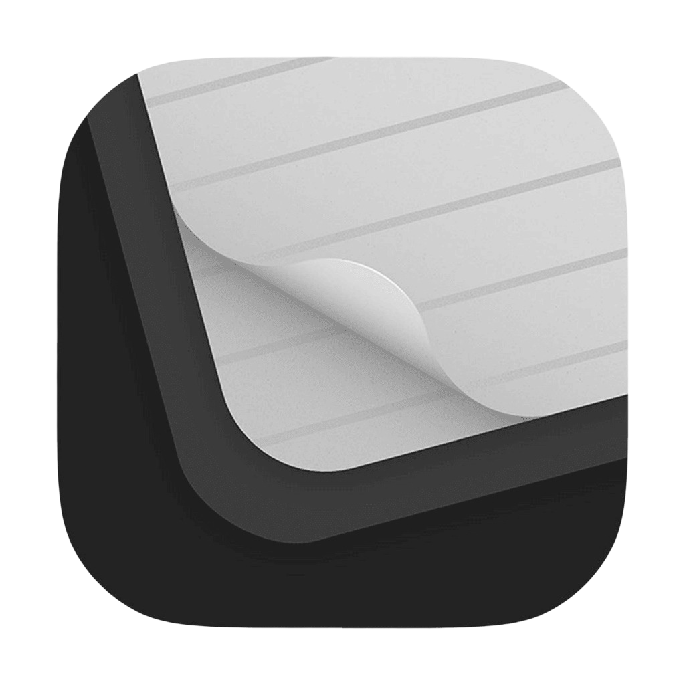

# TempScan - Advanced Mobile Document Scanner & PDF Editor



**TempScan** is a powerful, cross-platform Flutter mobile app for document scanning, OCR, PDF creation/editing, and automation. Transform your phone into a professional document management workstation with advanced AI-powered features like form recognition, auto-enhancement, and workflow automation.

## ✨ Key Features

### 📸 Scanning & Capture
- High-quality camera scanning with auto-detection
- Multi-page document capture
- Import from gallery, files, or existing PDFs
- Video-to-PDF conversion with thumbnails

### 🧠 AI-Powered Processing
- **Advanced OCR** - Extract editable text from scans (Google MLKit)
- **Form Recognition** - Auto-detect and fill forms
- **Auto-Enhancement** - Smart filters, de-skew, contrast optimization
- **Translation Service** - Real-time document translation
- **Eraser Tool** - Remove backgrounds/objects

### ✏️ Professional Editing
- Crop, rotate, annotate, and resize
- Digital signatures & watermarks
- Password protection
- PDF merging/splitting
- Image-to-PDF conversion

### 📁 Smart Organization
- Automatic document naming & tagging
- Folder-based organization (Bills, IDs, Receipts, Work)
- Full-text OCR search
- Recent documents & smart sorting

### ⚙️ Automation Workflows
- Custom automation rules (auto-export, auto-enhance, auto-tag)
- One-tap presets for common workflows
- Batch processing

### 💼 Export & Sharing
- High-quality PDF/JPG/PNG export
- Custom quality/resolution settings
- Share via any app
- Protected PDF export

## 🛠️ Tech Stack

| Category | Technologies |
|----------|--------------|
| **Framework** | Flutter (iOS/Android/Web/Desktop) |
| **Camera/ML** | camera, google_mlkit_text_recognition, google_mlkit_translation |
| **PDF** | pdf, pdfx, syncfusion_flutter_pdf |
| **Media** | image, video_player, chewie |
| **Storage** | path_provider, shared_preferences, file_picker |
| **Utils** | permission_handler, share_plus, archive |

## 🚀 Quick Start

### Prerequisites
- Flutter SDK 3.10.7+
- Android/iOS development environment

### Setup
```bash
flutter pub get
dart run flutter_launcher_icons
dart run flutter_native_splash:create
flutter run
```

## 📱 App Architecture

```
lib/
├── core/     # App lifecycle, constants
├── models/   # Document, Folder, AutomationRule
├── services/ # OCR, Automation, Storage
├── ui/       # Screens: Home, Camera, OCR, Review
├── camera/   # Camera capture
└── utils/    # File/video helpers
```

## 🎯 Status

✅ **Complete**: Scanning, OCR, editing, organization, automation foundation  
🔄 **Next**: Automation UI, advanced exports

## 📋 Examples

**Scan & OCR**:
1. Home → Scan
2. Review → OCR → Enhance
3. Export searchable PDF

**Merge PDFs**:
1. Home → Merge PDFs
2. Reorder → Watermark → Export

## 🤝 Contributing
Fork → Branch → Commit → PR

## 📄 License
Proprietary

**⭐ Star if useful!** Built with ❤️ by TempScan Team

